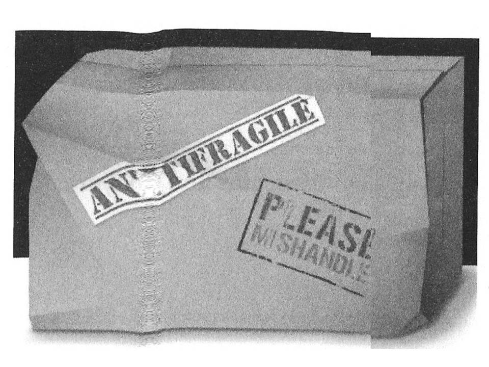
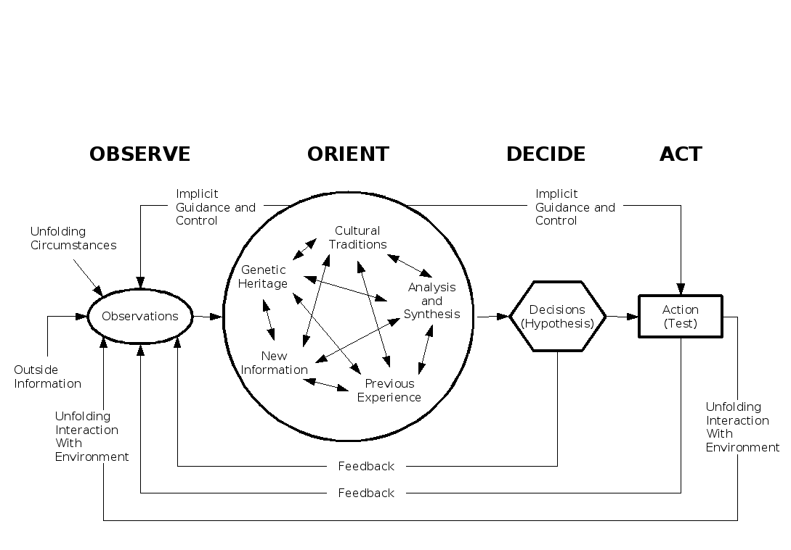

Still spørsmål underveis

. . .

... ikke nekt meg kontinuerlig tilbakemelding

---

*Hva er antonymet til **skjør**?*

. . .

Solid?

Motstandsdyktig?

Robust?

---

Hva er det motsatte av -1?

En skjør gjenstand *synker* i verdi utsatt for stress.

En robust gjenstand beholder samme verdi utsatt for stress. 

En antiskjør gjenstand *øker* i verdi utsatt for stress.

---

---

---

---

---

## Eksempler

Skjør | Robust | Antiskjør
-|-|-
Damokles | Føniks | Hydra
Vase | Stein | -
Enkeltmenneske | - | Gen
Ansatt privat | Ansatt offentlig | Selvansatt
Spesiell kunnskap | - | Generell kunnskap

---

## Hvordan operere antiskjørt

Noen pekepinner.

---

Tilbakemelding

---

Udetaljerte planer

---

Elsk feil

---

Kunnskap via subtraksjon

---

> Real mathematicians understand completeness. Real philosophers understand incompleteness. The rest don't formally understand anything.

N. N. Taleb

---

## Nerder

---

> **nerd** m1 (eng) person med rigid, internt konsistent rammeverk.

---

| Nerd | Ikkenerd |
| -----|--------- |
| Deklarativ | Prosessorientert |
| Sannhet | Utilitarisme |
| Regler | Prinsipper |
| "Følg reglene" | Gjør &rarr; Test &rarr; Evaluer |
| Lønnsomt i rigid domene | Lønnsomt i kaotisk domene |

---

### Rigide domener

Matematikk,
fysikk,
grammatikk,

. . .

programmering

### Fleksible og kaotiske domener

Kunst,
livet,
luftkamp*,

. . .

systemutvikling

 
 
 

*Digresjon

---

## Observe, Orient, Decide, Act

* Grunnprinsippene i opplæring av jagerflypiloter
* Har (John Boyd) revolusjonert vestlig krigføring i det 21. århundre

---

---

## Vår konkave hverdag

Planlegging.

---

## Kalkunen

. . .

Tidligere historikk kan ikke ekstrapoleres

---

## Vektstangen

---

## "Lecturing birds how to fly"

---

## Teknologi

> * [Pandoc](pandoc.org): konverterer ~alt av tekstformater
> * [reveal.js](https://github.com/hakimel/reveal.js/): lysbilder i HTML

---

## Leseliste

> * *Scrum: The Art of Doing Twice the Work in Half the Time* (Jeff Sutherland)
> * *Antifragile* (Nassim Nicholas Taleb)
> * *The Birth of Tragedy* (Friedrich Nietzsche)
  * *Thinking in Systems* (Donella H. Meadows)
  * *Thinking, Fast and Slow* (Daniel Kahneman)

Spørsmål og kommentarer er velkomne.

